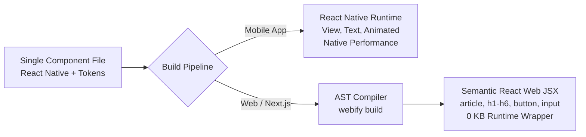

# @groooh/react-native-webify — Complete Guide & Architectural Reference

> **Write once in React Native using design tokens. Compile to 100% semantic, accessible, zero-runtime React & Next.js web code.**
>
> Author: **[d-naum](https://www.groooh.com)** &bull; Powered by **[www.groooh.com](https://www.groooh.com)**

---

## Table of Contents

1. [Introduction & Core Philosophy](#1-introduction--core-philosophy)
2. [Installation & Project Setup](#2-installation--project-setup)
   - [React Native / Expo Mobile App](#react-native--expo-mobile-app)
   - [Next.js / Vite / React Web App](#nextjs--vite--react-web-app)
   - [Monorepo Setup (Turborepo / Yarn / pnpm Workspaces)](#monorepo-setup)
3. [Quick Start Tutorial](#3-quick-start-tutorial)
4. [Using & Customizing Components in React Native](#4-using--customizing-components-in-react-native)
   - [Customizing with Design Tokens](#customizing-with-design-tokens)
   - [Customizing with Style Overrides](#customizing-with-style-overrides)
   - [Customizing Component Variants & Sizes](#customizing-component-variants--sizes)
5. [Token-Driven Web Component Generation](#5-token-driven-web-component-generation)
   - [How the AST Compiler Works](#how-the-ast-compiler-works)
   - [Design Token to CSS Mapping](#design-token-to-css-mapping)
   - [Element & Prop Transformations](#element--prop-transformations)
   - [Zero Runtime Overhead Guarantee](#zero-runtime-overhead-guarantee)
6. [Design Token Reference](#6-design-token-reference)
   - [Colors](#colors)
   - [Spacing](#spacing)
   - [Border Radius](#border-radius)
   - [Typography & Headings](#typography--headings)
   - [Breakpoints](#breakpoints)
7. [Comprehensive Component Reference (30+ Components)](#7-comprehensive-component-reference)
   - [Layout & Primitives (`Stack`, `Row`, `Box`, `ScrollView`, `FlatList`)](#layout--primitives)
   - [Typography (`Heading`, `Body`, `Caption`)](#typography)
   - [Actions (`Button`)](#actions)
   - [Form Inputs (`Input`, `PasswordInput`, `SearchInput`, `Textarea`, `Slider`, `Checkbox`, `Radio`, `RadioGroup`, `Select`, `DatePicker`, `OTPInput`)](#form-inputs)
   - [Data Display (`Card`, `Badge`, `Tag`, `Avatar`, `AvatarGroup`, `Divider`, `Accordion`, `Tabs`, `ProgressBar`, `Skeleton`)](#data-display)
   - [Overlays (`BottomSheet`, `Modal`, `Drawer`)](#overlays)
   - [Feedback (`Alert`, `Spinner`, `Toast`)](#feedback)
   - [E-Commerce (`Price`, `Rating`, `QuantitySelector`, `ProductCard`)](#e-commerce)
8. [Compiler CLI & Workflow](#8-compiler-cli--workflow)
   - [Commands & Flags](#commands--flags)
   - [Configuration File (`react-native-webify.config.json`)](#configuration-file)
   - [Active Watch Mode](#active-watch-mode)
9. [Next.js & React Web Integration Guide](#9-nextjs--react-web-integration-guide)
   - [Next.js App Router (RSC & SSR)](#nextjs-app-router)
   - [Client Interactivity & Event Handlers](#client-interactivity)
   - [Build Automation](#build-automation)
10. [Programmatic Node.js API](#10-programmatic-nodejs-api)
11. [FAQ & Troubleshooting](#11-faq--troubleshooting)

---

## 1. Introduction & Core Philosophy

### The Problem with Existing Solutions
Cross-platform development across React Native and Web has historically suffered from critical compromises:
- **`react-native-web`**: Operates as a runtime emulation layer. Every `<View>` and `<Text>` is converted into nested `<div>` and `<span>` elements with inline `display: flex`. This damages **SEO**, creates bloated DOM trees, causes hydration penalties in Next.js, and lacks true semantic HTML (`<article>`, `<button>`, `<input>`, `<dialog>`).
- **Monorepos with Divergent Codebases**: Teams end up maintaining two separate UI libraries (`components/mobile` and `components/web`), doubling engineering overhead and leading to design drift.

### The @groooh/react-native-webify Solution
`@groooh/react-native-webify` by **d-naum** ([www.groooh.com](https://www.groooh.com)) uses an **ahead-of-time (AOT) AST compiler**:



1. **In Mobile (iOS & Android)**: Your components render using optimized native primitives, gesture handlers, and layout engines.
2. **On Web**: The compiler transpiles your components into clean, semantic React JSX (`<article>`, `<h1>`, `<button>`, `<dialog>`) with design tokens compiled directly into inline CSS styles. All React Native imports are removed at build time.

---

## 2. Installation & Project Setup

### React Native / Expo Mobile App

```bash
# npm
npm install @groooh/react-native-webify

# yarn
yarn add @groooh/react-native-webify

# pnpm
pnpm add @groooh/react-native-webify
```

If using Expo, `@groooh/react-native-webify` works out of the box with zero native configuration required.

### Next.js / Vite / React Web App

For your web application, install `@groooh/react-native-webify` as a dev dependency so you have access to the compiler CLI and programmatic API:

```bash
# npm
npm install -D @groooh/react-native-webify

# yarn
yarn add -D @groooh/react-native-webify

# pnpm
pnpm add -D @groooh/react-native-webify
```

### Monorepo Setup (Turborepo / Yarn / pnpm Workspaces)

In a typical cross-platform repository:
```
apps/
  ├── mobile/              # Expo / React Native project
  │     └── package.json   # depends on "@groooh/react-native-webify": "*"
  └── web/                 # Next.js / Vite project
        └── package.json   # devDepends on "@groooh/react-native-webify": "*"
packages/
  └── ui/                  # Shared cross-platform components
```

In `apps/web/package.json`:
```json
{
  "scripts": {
    "compile:ui": "webify build -i ../../packages/ui -o ./src/generated",
    "dev": "npm run compile:ui && next dev",
    "build": "npm run compile:ui && next build"
  }
}
```

---

## 3. Quick Start Tutorial

### Step 1: Create a Shared Component

Write your component once using `@groooh/react-native-webify`:

```tsx
// components/HeroCard.tsx
import React from "react";
import {
  Card,
  Row,
  Stack,
  Avatar,
  Heading,
  Body,
  Badge,
  Button,
  Divider,
} from "@groooh/react-native-webify";

export interface HeroCardProps {
  title?: string;
  subtitle?: string;
  authorName?: string;
  badgeText?: string;
  onPrimaryAction?: () => void;
}

export const HeroCard = ({
  title = "Universal Cross-Platform Architecture",
  subtitle = "Write components once with design tokens. Deploy natively on iOS & Android, compile to semantic HTML on Web.",
  authorName = "Groooh Engineering",
  badgeText = "Production Ready",
  onPrimaryAction,
}: HeroCardProps) => {
  return (
    <Card padding="lg">
      <Stack gap="md">
        <Row align="center" justify="between">
          <Row align="center" gap="sm">
            <Avatar name={authorName} size="md" />
            <Stack gap="xs">
              <Body weight="bold">{authorName}</Body>
              <Body size="xs" color="neutral.500">Cross-Platform UI Framework</Body>
            </Stack>
          </Row>
          <Badge variant="success" label={badgeText} />
        </Row>

        <Divider />

        <Heading variant="h2">{title}</Heading>
        <Body size="sm" color="neutral.600">{subtitle}</Body>

        <Row justify="end" gap="sm">
          <Button variant="secondary" size="md">Documentation</Button>
          <Button variant="primary" size="md" onPress={onPrimaryAction}>
            Get Started
          </Button>
        </Row>
      </Stack>
    </Card>
  );
};
```

### Step 2: Compile to Web

Run the `webify` compiler:
```bash
npx webify build -i components -o web/src/generated
```

### Step 3: Inspect the Generated Web JSX

The compiler creates `web/src/generated/HeroCard.web.tsx`:

```tsx
import * as React from "react";

export const HeroCard = ({
  title = "Universal Cross-Platform Architecture",
  subtitle = "Write components once with design tokens. Deploy natively on iOS & Android, compile to semantic HTML on Web.",
  authorName = "Groooh Engineering",
  badgeText = "Production Ready",
  onPrimaryAction,
}) => {
  return (
    <article style={{ backgroundColor: "#ffffff", borderRadius: "12px", border: "1px solid #e5e7eb", padding: "24px" }}>
      <div style={{ display: "flex", flexDirection: "column", gap: "16px" }}>
        <div style={{ display: "flex", flexDirection: "row", alignItems: "center", justifyContent: "space-between" }}>
          <div style={{ display: "flex", flexDirection: "row", alignItems: "center", gap: "8px" }}>
            <figure style={{ display: "inline-flex", alignItems: "center", justifyContent: "center", borderRadius: "9999px", width: "40px", height: "40px" }} />
            <div style={{ display: "flex", flexDirection: "column", gap: "4px" }}>
              <p style={{ fontWeight: 700, margin: 0 }}>{authorName}</p>
              <p style={{ fontSize: "12px", color: "#6b7280", margin: 0 }}>Cross-Platform UI Framework</p>
            </div>
          </div>
          <span style={{ backgroundColor: "#dcfce7", color: "#166534", borderRadius: "9999px", padding: "2px 8px" }}>
            {badgeText}
          </span>
        </div>

        <hr style={{ border: "none", borderTop: "1px solid #e5e7eb", margin: 0 }} />

        <h2 style={{ fontSize: "24px", fontWeight: 700, margin: 0 }}>{title}</h2>
        <p style={{ fontSize: "14px", color: "#4b5563", margin: 0 }}>{subtitle}</p>

        <div style={{ display: "flex", flexDirection: "row", justifyContent: "flex-end", gap: "8px" }}>
          <button style={{ backgroundColor: "#f3f4f6", color: "#111827", borderRadius: "8px", cursor: "pointer" }}>
            Documentation
          </button>
          <button onClick={onPrimaryAction} style={{ backgroundColor: "#6366f1", color: "#ffffff", borderRadius: "8px", cursor: "pointer" }}>
            Get Started
          </button>
        </div>
      </div>
    </article>
  );
};
```

---

## 4. Using & Customizing Components in React Native

### Customizing with Design Tokens

All `@groooh/react-native-webify` components accept design tokens for spacing, colors, borders, and typography. You do not write manual StyleSheet calculations or pixel values.

```tsx
import React from "react";
import { Card, Stack, Heading, Body, Button } from "@groooh/react-native-webify";

export const CustomCard = () => {
  return (
    <Card
      padding="xl"             // maps to 32px spacing token
      radius="lg"              // maps to 12px border radius token
      backgroundColor="neutral.50" // maps to #f9fafb color token
      borderColor="primary.300"    // maps to #a5b4fc color token
    >
      <Stack gap="md">         // maps to 16px vertical gap
        <Heading
          variant="h3"         // maps to 20px, semibold font
          color="primary.700"  // maps to #4338ca
        >
          Customized Card
        </Heading>
        <Body
          size="sm"            // maps to 14px body font
          color="neutral.600"  // maps to #4b5563
        >
          Tokens apply cleanly across both React Native and Web.
        </Body>
      </Stack>
    </Card>
  );
};
```

### Customizing with Style Overrides

Every component accepts standard React Native `style` props when you need custom overrides:

```tsx
<Stack
  gap="sm"
  style={{
    shadowColor: "#000",
    shadowOpacity: 0.1,
    shadowRadius: 10,
    elevation: 4,
  }}
>
  ...
</Stack>
```

On web compilation, inline style objects pass through intact into the React Web `style={{ ... }}` prop.

### Customizing Component Variants & Sizes

Components offer standardized variants and sizes:

```tsx
// Button Variants
<Button variant="primary">Primary</Button>
<Button variant="secondary">Secondary</Button>
<Button variant="ghost">Ghost</Button>
<Button variant="danger">Danger</Button>
<Button variant="link">Link</Button>

// Button Sizes
<Button size="xs">Extra Small</Button>
<Button size="sm">Small</Button>
<Button size="md">Medium</Button>
<Button size="lg">Large</Button>
<Button size="xl">Extra Large</Button>

// Badges & Tags
<Badge variant="primary" label="New" />
<Badge variant="success" label="Active" />
<Badge variant="warning" label="Pending" />
<Badge variant="danger" label="Failed" />
<Tag variant="primary" label="TypeScript" onRemove={() => {}} />
```

---

## 5. Token-Driven Web Component Generation

### How the AST Compiler Works

The compiler operates on TypeScript AST nodes:
1. **Parses the Source File**: Uses TypeScript's parser to produce an Abstract Syntax Tree.
2. **Import Elimination**: Automatically strips `import ... from "react-native"` and `import ... from "@groooh/react-native-webify"`.
3. **Component Node Transformation**: Matches JSX elements (`Card`, `Stack`, `Heading`, `Button`, `Input`, `Modal`, etc.) and replaces them with their semantic HTML counterpart.
4. **Token Resolution**: Statically resolves token props (`padding="lg"`, `gap="md"`, `color="primary.500"`, `radius="md"`) into CSS properties.
5. **Event Mapping**: Converts `onPress` into `onClick`, `onLongPress` into `onDoubleClick`, `accessibilityLabel` into `aria-label`, etc.
6. **Code Printing**: Prints standard React TSX/JSX ready for direct execution in any web framework.

### Design Token to CSS Mapping

| Token Attribute | React Native Input | Web CSS Output |
|---|---|---|
| Spacing `xs` | `padding="xs"`, `gap="xs"` | `padding: "4px"`, `gap: "4px"` |
| Spacing `sm` | `padding="sm"`, `gap="sm"` | `padding: "8px"`, `gap: "8px"` |
| Spacing `md` | `padding="md"`, `gap="md"` | `padding: "16px"`, `gap: "16px"` |
| Spacing `lg` | `padding="lg"`, `gap="lg"` | `padding: "24px"`, `gap: "24px"` |
| Spacing `xl` | `padding="xl"`, `gap="xl"` | `padding: "32px"`, `gap: "32px"` |
| Spacing `2xl` | `padding="2xl"`, `gap="2xl"` | `padding: "48px"`, `gap: "48px"` |
| Radius `sm` | `radius="sm"` | `borderRadius: "4px"` |
| Radius `md` | `radius="md"` | `borderRadius: "8px"` |
| Radius `lg` | `radius="lg"` | `borderRadius: "12px"` |
| Radius `full` | `radius="full"` | `borderRadius: "9999px"` |
| Color `primary.500` | `color="primary.500"` | `color: "#6366f1"` |
| Color `neutral.50` | `backgroundColor="neutral.50"` | `backgroundColor: "#f9fafb"` |
| Color `success.500` | `color="success.500"` | `color: "#22c55e"` |

### Element & Prop Transformations

| React Native Pattern | Web JSX Output |
|---|---|
| `<Card padding="lg">` | `<article style={{ padding: "24px", ... }}>` |
| `<Heading variant="h1">` | `<h1 style={{ fontSize: "32px", ... }}>` |
| `<Heading variant="h2">` | `<h2 style={{ fontSize: "24px", ... }}>` |
| `<Heading variant="h3">` | `<h3 style={{ fontSize: "20px", ... }}>` |
| `<Body size="md">` | `<p style={{ fontSize: "16px", ... }}>` |
| `<Caption>` | `<span style={{ fontSize: "12px", ... }}>` |
| `<Button onPress={fn}>` | `<button onClick={fn} style={{ ... }}>` |
| `<PasswordInput placeholder="..." />` | `<input type="password" placeholder="..." />` |
| `<SearchInput placeholder="..." />` | `<input type="search" placeholder="..." />` |
| `<Slider min={0} max={100} />` | `<input type="range" min="0" max="100" />` |
| `<Modal visible={open}>` | `<dialog open={open} style={{ ... }}>` |
| `<ProgressBar progress={0.65} />` | `<progress max="100" value="65" />` |
| `<Divider />` | `<hr style={{ border: "none", borderTop: "1px solid ..." }} />` |
| `<Accordion items={...} />` | `<details><summary>...</summary>...</details>` |

### Zero Runtime Overhead Guarantee
Unlike other libraries, `@groooh/react-native-webify` does not require importing any runtime shim into your web bundle.
- **Web bundle size impact from compiler**: **0 KB**
- **DOM elements**: Native HTML5 elements
- **Styles**: Inline CSS objects evaluated at build time

---

## 6. Design Token Reference

You can import tokens in code via `@groooh/react-native-webify/tokens`:

```tsx
import { colors, spacing, radius, fontSize, fontWeight, breakpoints } from "@groooh/react-native-webify/tokens";
```

### Colors
6 semantic families, each with 10 shades (50–900):

- `colors.primary`:
  - `50`: `#eef2ff`, `100`: `#e0e7ff`, `200`: `#c7d2fe`, `300`: `#a5b4fc`
  - `400`: `#818cf8`, `500`: `#6366f1` (Brand Primary)
  - `600`: `#4f46e5`, `700`: `#4338ca`, `800`: `#3730a3`, `900`: `#312e81`
- `colors.neutral`:
  - `50`: `#f9fafb`, `100`: `#f3f4f6`, `200`: `#e5e7eb`, `300`: `#d1d5db`
  - `400`: `#9ca3af`, `500`: `#6b7280`, `600`: `#4b5563`, `700`: `#374151`
  - `800`: `#1f2937`, `900`: `#111827`
- `colors.success`: `#22c55e` base (500)
- `colors.warning`: `#f59e0b` base (500)
- `colors.error`: `#ef4444` base (500)
- `colors.info`: `#0ea5e9` base (500)

### Spacing
- `spacing.xs`: `4px`
- `spacing.sm`: `8px`
- `spacing.md`: `16px`
- `spacing.lg`: `24px`
- `spacing.xl`: `32px`
- `spacing["2xl"]`: `48px`
- `spacing["3xl"]`: `64px`
- `spacing["4xl"]`: `96px`

### Border Radius
- `radius.none`: `0px`
- `radius.xs`: `2px`
- `radius.sm`: `4px`
- `radius.md`: `8px`
- `radius.lg`: `12px`
- `radius.xl`: `16px`
- `radius.full`: `9999px`

### Typography & Headings
- `fontSize.xs`: `12px` (lineHeight: `16px`)
- `fontSize.sm`: `14px` (lineHeight: `20px`)
- `fontSize.md`: `16px` (lineHeight: `24px`)
- `fontSize.lg`: `18px` (lineHeight: `28px`)
- `fontSize.xl`: `20px` (lineHeight: `28px`)
- `fontSize["2xl"]`: `24px` (lineHeight: `32px`)
- `fontSize["3xl"]`: `30px` (lineHeight: `36px`)
- `fontSize["4xl"]`: `36px` (lineHeight: `40px`)

---

## 7. Comprehensive Component Reference

### Layout & Primitives

#### `<Stack>`
Vertical flexbox container.
- **Web Tag**: `<div>` (`display: flex; flex-direction: column`)
- **Props**: `gap`, `padding`, `paddingX`, `paddingY`, `align`, `justify`.

#### `<Row>`
Horizontal flexbox container.
- **Web Tag**: `<div>` (`display: flex; flex-direction: row`)
- **Props**: `gap`, `padding`, `paddingX`, `paddingY`, `align`, `justify`, `wrap`.

#### `<Box>` / `<View>`
Universal box container.
- **Web Tag**: `<div>`
- **Props**: `bg`, `radius`, `padding`, `flex`, `borderColor`, `borderWidth`.

#### `<ScrollView>`
Scrollable view container.
- **Web Tag**: `<div style={{ overflowY: "auto" }}>` (or `overflowX` if `horizontal`).

#### `<FlatList>`
Virtualized list that compiles to native `.map()` array mapping on web.

---

### Typography

#### `<Heading>`
Renders semantic heading levels `h1` through `h6`.
```tsx
<Heading variant="h1">Display Title</Heading>
<Heading variant="h2" color="primary.600">Section Title</Heading>
```

#### `<Body>`
Renders standard paragraph copy with size and weight options.
```tsx
<Body size="md" weight="medium" color="neutral.700">Paragraph text.</Body>
```

#### `<Caption>`
Renders micro-copy, timestamps, and metadata tags as `<span>`.
```tsx
<Caption color="neutral.500">Last updated 5 mins ago</Caption>
```

---

### Actions

#### `<Button>`
High-performance button supporting 5 variants, 5 sizes, loading states, and icon slots.
- **Web Tag**: `<button>`
- **Variants**: `"primary" | "secondary" | "ghost" | "danger" | "link"`
- **Sizes**: `"xs" | "sm" | "md" | "lg" | "xl"`
- **Props**: `onPress`, `disabled`, `loading`, `fullWidth`, `leftIcon`, `rightIcon`.

```tsx
<Button variant="primary" size="md" onPress={() => handleSave()}>
  Save Changes
</Button>
```

---

### Form Inputs

| Component | Web Output | Usage Example |
|---|---|---|
| `<Input>` | `<input type="text">` | `<Input label="Full Name" placeholder="Jane Doe" />` |
| `<PasswordInput>` | `<input type="password">` | `<PasswordInput label="Password" />` |
| `<SearchInput>` | `<input type="search">` | `<SearchInput placeholder="Search records..." />` |
| `<Textarea>` | `<textarea>` | `<Textarea label="Bio" rows={4} />` |
| `<Slider>` | `<input type="range">` | `<Slider minimumValue={0} maximumValue={100} value={50} />` |
| `<Checkbox>` | `<input type="checkbox">` | `<Checkbox label="Agree to Terms" checked={agreed} />` |
| `<RadioGroup>` | `<fieldset>` + `<input type="radio">` | Radio selection group with label options |
| `<Select>` | `<select>` + `<option>` | Native dropdown select picker |
| `<DatePicker>` | `<input type="date">` | Calendar date picker with native SVG calendar icon |
| `<OTPInput>` | Multi-box numeric PIN inputs | `<OTPInput length={6} onComplete={(pin) => verify(pin)} />` |

---

### Data Display

- `<Card padding="lg">`: Compiles to `<article style="...">`.
- `<Badge variant="success" label="Active" />`: Compiles to `<span style="...">`.
- `<Tag variant="primary" label="React Native" onRemove={...} />`: Removable chip.
- `<Avatar name="d-naum" size="md" uri="..." />`: Portrait with fallback initials.
- `<AvatarGroup users={members} max={4} />`: Overlapping stack with `+N` indicator.
- `<Divider />`: Semantic `<hr style="...">`.
- `<Accordion items={faqList} />`: Collapsible `<details>`/`<summary>`.
- `<Tabs tabs={tabs} activeTab={active} onChange={setActive} />`: Segmented control.
- `<ProgressBar progress={75} />`: Native `<progress max="100" value="75">`.
- `<Skeleton width={200} height={24} radius="sm" />`: Pulsing placeholder.

---

### Overlays & Feedback

- `<Modal visible={open} onClose={...}>`: Compiles to accessible `<dialog>` on web.
- `<BottomSheet visible={open} onClose={...}>`: Smooth sliding sheet modal on mobile.
- `<Drawer visible={open} side="left">`: Side navigation drawer (`<aside>` on web).
- `<Alert variant="danger">`: Accessible `<div role="alert">`.
- `<Spinner size="md" />`: SVG circular spinner with `<div role="status">`.
- `<Toast visible={show} message="Saved!" />`: Toast notification banner.

---

### E-Commerce

`@groooh/react-native-webify` provides first-class primitives for building high-conversion e-commerce applications, mobile storefronts, and web product catalogs.

#### `<Price>`
Renders currency-formatted amounts with optional strikethrough comparison pricing and automatic discount badge calculation.
- **Web Output**: `<div style="...">` containing `<span>` and `<del>`
- **Props**:
  - `amount`: `number | string` (Current selling price)
  - `currency`: `string` (e.g. `"$"` or `"€"`, default `"$"` )
  - `originalAmount`: `number | string` (Strikethrough comparison price)
  - `discountBadge`: `boolean | string` (Auto-calculates `"-20%"` or custom string)
  - `size`: `"sm" | "md" | "lg" | "xl"` (Default `"md"`)
  - `color`: `string` (Custom text color)

```tsx
<Price
  amount={279.99}
  originalAmount={349.99}
  currency="$"
  size="lg"
/>
```

#### `<Rating>`
Renders star rating displays with numeric score and customer review counts. Supports both read-only display and interactive star selection modes.
- **Web Output**: `<div role="img" aria-label="Rated X out of 5 stars">`
- **Props**:
  - `value`: `number` (Current rating 0–5)
  - `max`: `number` (Maximum stars, default `5`)
  - `count`: `number | string` (Review count e.g. `142` or `"1.4k"`)
  - `readOnly`: `boolean` (Default `true`)
  - `onChange`: `(rating: number) => void` (Triggered on click in interactive mode)
  - `size`: `"sm" | "md" | "lg"` (Default `"md"`)
  - `color`: `string` (Star fill color, default warning amber)

```tsx
{/* Read-only review badge */}
<Rating value={4.8} count={2840} size="sm" />

{/* Interactive star rater */}
<Rating
  value={userRating}
  readOnly={false}
  onChange={(newRating) => setUserRating(newRating)}
  size="lg"
/>
```

#### `<QuantitySelector>`
Accessible stepper control for modifying shopping cart item quantities and purchase counts with bounds enforcement.
- **Web Output**: `<div role="group" aria-label="Quantity selector">` with decrement `<button>`, value `<span>`, and increment `<button>`
- **Props**:
  - `value`: `number` (Current quantity)
  - `onChange`: `(quantity: number) => void` (Quantity change callback)
  - `min`: `number` (Minimum selectable value, default `1`)
  - `max`: `number` (Maximum inventory limit, default `99`)
  - `step`: `number` (Step increment, default `1`)
  - `size`: `"sm" | "md" | "lg"` (Default `"md"`)
  - `disabled`: `boolean` (Disable stepper buttons)

```tsx
<QuantitySelector
  value={cartQuantity}
  min={1}
  max={10}
  onChange={(qty) => setCartQuantity(qty)}
/>
```

#### `<ProductCard>`
Comprehensive product tile featuring image carousel, promotional badge, interactive wishlist heart toggle, product title, category, star rating, price comparison, full card tap event, and add-to-cart action.
- **Web Output**: Semantic `<article>` card with optimized ``, `<h3>`, formatted price, and `<button>` elements
- **Props & Events**:
  - `title`: `string` (Product title)
  - `price`: `number | string` (Current selling price)
  - `originalPrice`: `number | string` (Original comparison price)
  - `currency`: `string` (Currency symbol, default `"$"` )
  - `images`: `string[]` (Array of images for interactive ImageSlider carousel)
  - `imageUri`: `string` (Single fallback product image URI)
  - `rating`: `number` (Star score 0–5)
  - `ratingCount`: `number | string` (Review count)
  - `badgeText`: `string` (Promo badge e.g. `"SALE"` or `"BESTSELLER"`)
  - `category`: `string` (Brand or department)
  - `isWishlisted`: `boolean` (Heart active state)
  - `onPress`: `() => void` (**Card & image tap event**)
  - `onWishlist`: `() => void` (Wishlist heart toggle handler)
  - `onAddToCart`: `() => void` (Add to cart button handler)

```tsx
<ProductCard
  title="Sony WH-1000XM5 Wireless Noise-Canceling Headphones"
  category="Audio & Electronics"
  price={279.99}
  originalPrice={349.99}
  images={[
    "https://images.unsplash.com/photo-1505740420928-5e560c06d30e?w=600",
    "https://images.unsplash.com/photo-1484704849700-f032a568e944?w=600",
  ]}
  rating={4.9}
  ratingCount={2840}
  badgeText="Best Seller"
  isWishlisted={isWishlisted}
  onPress={() => navigateToProductDetails(productId)}
  onWishlist={() => setIsWishlisted(!isWishlisted)}
  onAddToCart={() => addToCart(productId)}
/>
```

> 📖 **Full Components & Events Guide**: For deep API signatures, token customization, and item tap event callbacks for all 35+ components, see [docs/COMPONENTS_REFERENCE.md](file:///f:/Dev/cross-platform-ui/docs/COMPONENTS_REFERENCE.md).

---

## 8. Compiler CLI & Workflow

The CLI binary is installed as `webify` (with aliases `react-native-webify` and `rn-to-react`).

### Commands & Flags
```bash
# Compile once
webify build -i src/components -o web/src/generated

# Run continuous watch mode during development
webify build -i src/components -o web/src/generated --watch
```

### Configuration File (`react-native-webify.config.json`)
You can store your paths in `react-native-webify.config.json`:

```json
{
  "input": "./src/components",
  "output": "./web/src/generated",
  "recursive": true
}
```

Then simply execute:
```bash
webify build
```

---

## 9. Next.js & React Web Integration Guide

### Next.js App Router (RSC & SSR)

The compiled `.web.tsx` components are pure React JSX using semantic HTML elements. They can be imported directly into:
1. **Server Components (`app/page.tsx`)**: Components without client interactivity render server-side with zero hydration cost and 100% SEO scores.
2. **Client Components (`'use client'`)**: Add event handlers (`onClick`, `onChange`, `onSubmit`) seamlessly.

```tsx
// app/dashboard/page.tsx (Next.js Server Component)
import { HeroCard } from "@/generated/HeroCard.web";

export default function DashboardPage() {
  return (
    <main>
      <HeroCard
        title="Universal Design System"
        subtitle="Compiled at build time by @groooh/react-native-webify"
        authorName="Groooh Engineering"
      />
    </main>
  );
}
```

### Build Automation in `package.json`

```json
{
  "scripts": {
    "compile:ui": "webify build -i ../mobile/components -o ./src/generated",
    "dev": "npm run compile:ui && next dev",
    "build": "npm run compile:ui && next build",
    "watch:ui": "webify build -i ../mobile/components -o ./src/generated --watch"
  }
}
```

---

## 10. Programmatic Node.js API

You can call the compiler directly in your custom Node build scripts:

```ts
import {
  transformReactNativeToReact,
  compileDirectory,
} from "@groooh/react-native-webify/compiler";

// Transform single file content
const outputJsx = transformReactNativeToReact(sourceCode, "HeroCard.tsx");

// Compile directory programmatically
compileDirectory({
  inputDirectory: "./src/components",
  outputDirectory: "./web/src/generated",
  recursive: true,
});
```

---

## 11. FAQ & Troubleshooting

#### Q: Do I need `react-native-web` installed in my web app?
**No.** `@groooh/react-native-webify` completely replaces `react-native-web`. The compiler eliminates all native imports and translates components to standard HTML5 at build time.

#### Q: How does event handling translate?
- `onPress` becomes `onClick`
- `onLongPress` becomes `onDoubleClick`
- `onChangeText` becomes `onChange`
- `accessibilityLabel` becomes `aria-label`
- `accessibilityRole` becomes `role`

#### Q: What versions of React and React Native are supported?
- **React**: 18.x and 19.x
- **React Native**: 0.74+ through 0.87+
- **TypeScript**: 5.0+

---

## 👨‍💻 Author & Support

- **Author**: `d-naum`
- **Website**: [www.groooh.com](https://www.groooh.com)
- **Documentation**: [https://www.groooh.com](https://www.groooh.com)

&copy; 2026 **d-naum** &bull; **Groooh**. Published under the MIT License.
